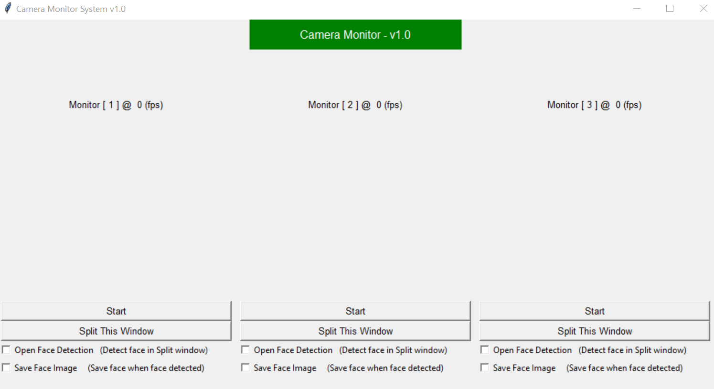
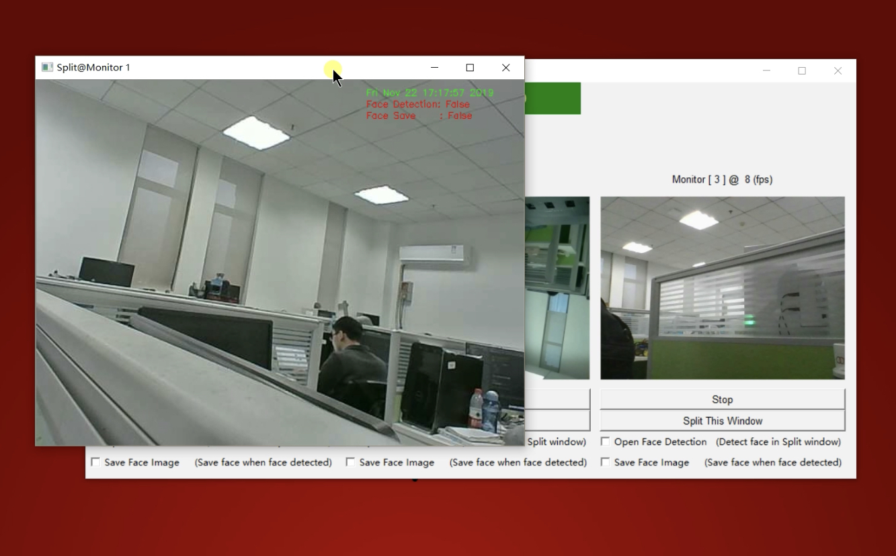
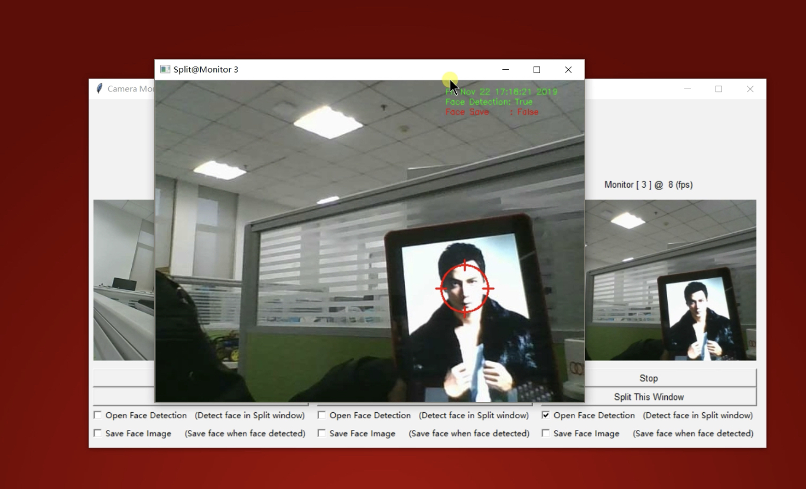

##Camera Monitor System

### Introduction
This is a monitor system which implemented with Python and Raspberry Pi. It can receive the monitors’ camera frame. The Application looks like this:

I conneted 3 monitors on this platform, which named Monitor[1], Monitor[2], Monitor[3]. Press the `Start` and wait the image come. When image shows on your system, you can press `Split Window` to get a bigger window to watch this monitor, it should look like this:

Besides, there are two optional buttons for you. If you select `Face Detection` button, your Split Window will strat to detect human face, and if you also select `Save Face Image` the Face images will save at “./face_history/”.

### Usage
1. You need to change the monitor IP in the file `SubWindow.py:  MONITOR_ADDR(list)`to specify your monitors’ address.
2. Run this Application with cammand: 
`python main.py`
